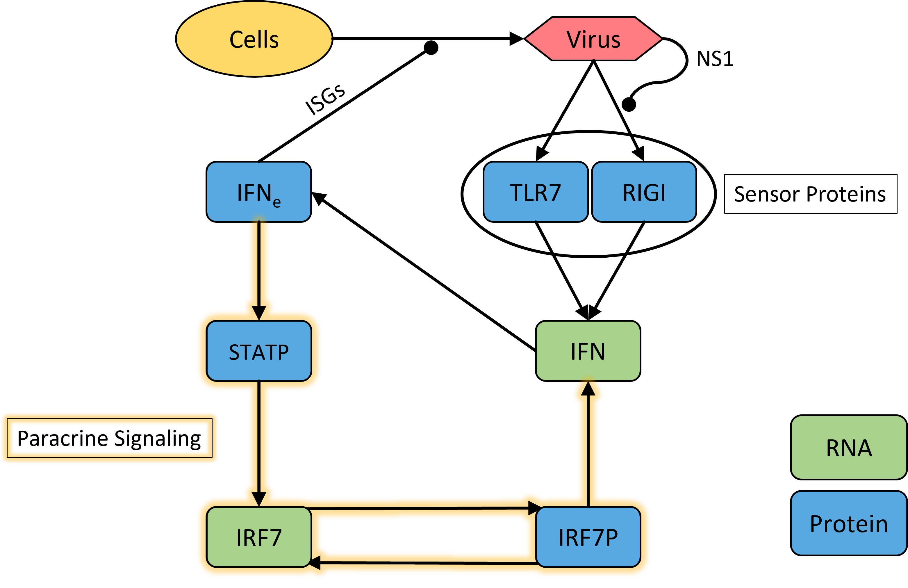
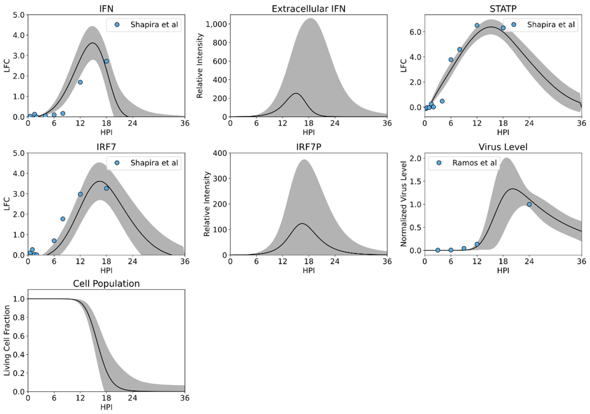

# Innate Immune Response Model
A mathematical model of inteferon response from viral respiratory infections in humans. This model aims to explain the mechanistic roots of viral clearance and abberant immune responses such as cytokine storm and long-COVID. Also included is the manuscript's original Parallel-Tempering Markov Chain Monte Carlo, a stochastic parameter exploration algorithm that, used in conjuction with data from Human Bronchial Epithelial Cells undergoing influenza infection, produces a range of possible immune outcomes. Original publication: https://www.mdpi.com/2227-9717/8/6/719

# Abstract
RNA viruses, such as influenza and Severe Acute Respiratory Syndrome (SARS), invoke excessive immune responses; however, the kinetics that regulate inflammatory responses within infected cells remain unresolved. Here, we develop a mathematical model of the RNA virus sensing pathways, to determine the intracellular events that primarily regulate interferon, an important protein for the activation and management of inflammation. Within the ordinary differential equation (ODE) model, we incorporate viral replication, cell death, interferon stimulated genes’ antagonistic effects on viral replication, and virus sensor protein (TLR and RIG-I) kinetics. The model is parameterized to influenza infection data using Markov chain Monte Carlo and then validated against infection data from an NS1 knockout strain of influenza, demonstrating that RIG-I antagonism significantly alters cytokine signaling trajectory. Global sensitivity analysis suggests that paracrine signaling is responsible for the majority of cytokine production, suggesting that rapid cytokine production may be best managed by influencing extracellular cytokine levels. As most of the model kinetics are host cell specific and not virus specific, the model presented provides an important step to modeling the intracellular immune dynamics of many RNA viruses, including the viruses responsible for SARS, Middle East Respiratory Syndrome (MERS), and Coronavirus Disease (COVID-19).

# Code
A python3 Jupyter notebook is included which solves the same ODE system as the original publication, and reproduces a limited number of plots. Julia code is provided for PT-MCMC parameter exploration. This is a time-intensive algorithm; 1E6 iterations will consume roughly 40 hours of CPU time, and the results will require roughly 4GB of storage. These raw parameter explorations are not included in this repository for storage limitations. THe results of large explorations can be seen in the original publication, and similar results recreated at will with the provided code.

# Plots
A visual schematic of the model from the original publication is given below.

Here, the model reproduces infection dynamics from influenza in Human Bronchial Epithelial Cells.
